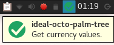
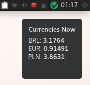

# Ideal Octo Palm Tree
I spend most of the time on my linux machine now, so being a macOS user for so long made me very used to their type of widgets and I kinda miss them. Since I use xfce for my GUI and it lacks of widgets I decided to create something light and very minimalist to keep track of things I daily need to check such as wheater, currency values, time-zones, etc. 

# Installation
TODO.

I need to figure out how to add the shortcut dinamically in the panel.

# TODO
- [x] Add a better API wrapper.
- [x] Json file for settings and preferences.
- [ ] Add other stuff, like wheater and time-zones.

# Demo (work in progress)

